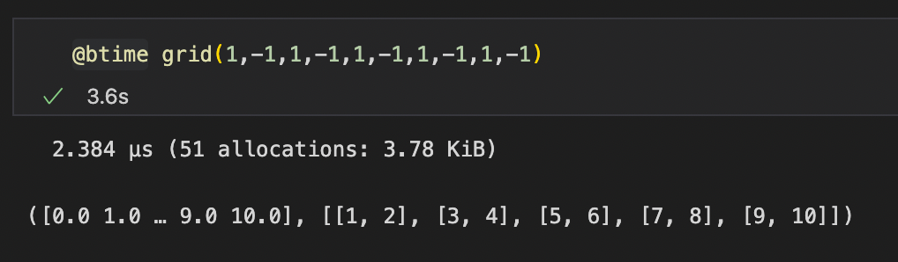
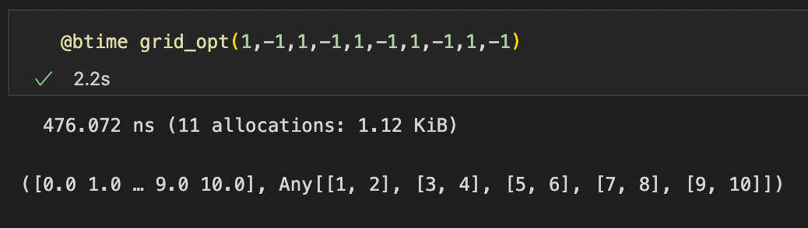
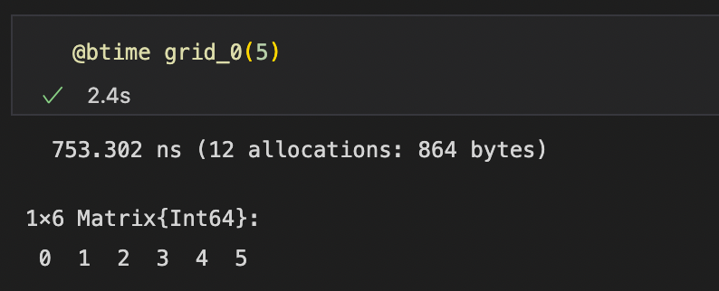
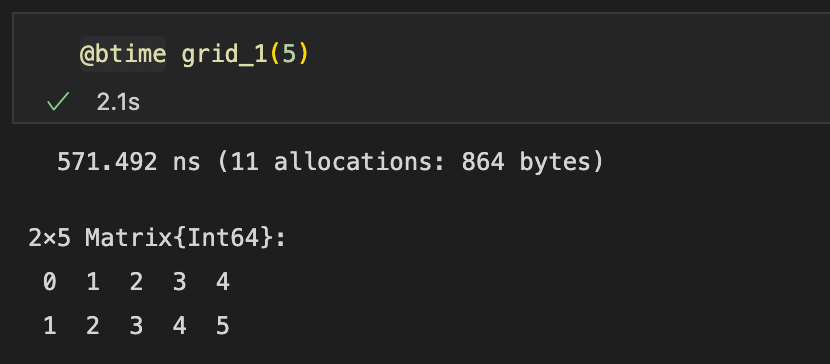
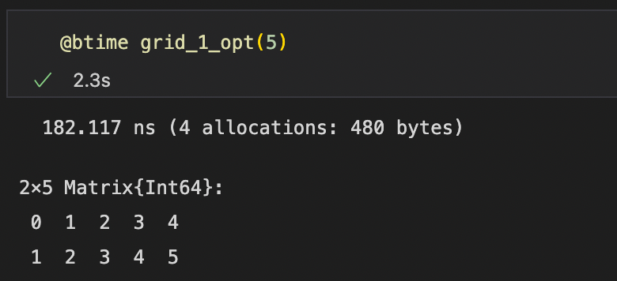
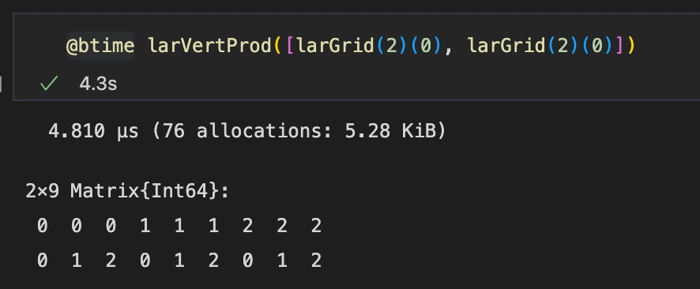
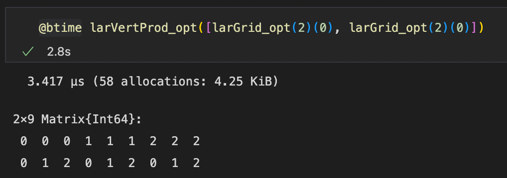
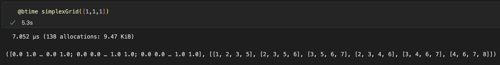
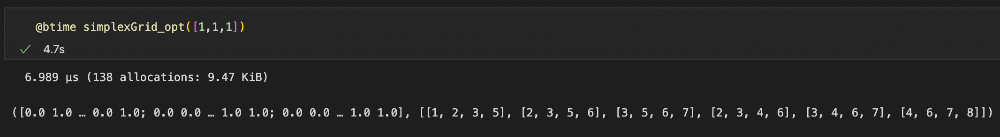

# Studio esecutivo: LAR cuboids & simplicial
Nel seguente documento verrà illustrato lo studio esecutivo per il progetto numero 1 - **LAR cuboids & simplicial**, nel quale saranno descritte le ottimizzazioni fatte per i due file sorgenti *largrid.jl* e *simplexn.jl* presenti all'interno della libreria **Lar** (Linear Algebraic Rapresentation). 

## Autori: 
* Alessandro Dell'Oste: 502589
* Maurizio Brini: 505195
* Manuel Granchelli: 512406

## Repo GitHub: 
https://github.com/adelloste/LinearAlgebraicRepresentation.jl

## Indice
* [Obiettivo](#obiettivo)
* [Analisi](#analisi)
* [Test](#test)

### Obiettivo 
L'obiettivo preliminare del seguente studio esecutivo è stato quello di analizzare i file sorgente e individuare le eventuali ottimizzazioni da poter effettuare all'interno del codice, facendo riferimento a quanto discusso in aula durante le lezioni e ai capitoli del libro consigliato **Julia High Performace**. In seguito, sono state testate alcune tecniche di ottimizzazione sui file sorgenti *simplexn.jl* e *largrid.jl*.

### Analisi
L'analisi è partita dal file sorgente **largrid.jl** nel quale sono state analizzate inizialmente le funzioni più compatte, come ad esempio le funzioni: **qn**, **grid_0**, **grid_1**, nelle quali sono stati cambiati i tipi delle variabili e sono state rimosse le funzioni *hcat* e *vcat*. Il tipo `Array{T,1}` è stato rimpiazzato con il tipo `Vector{T}` mentre per *array multidimensionali* si è fatto ricorso al `Matrix{T}`. Il cambio di tipo, anche se in minima parte, ha migliorato le prestazioni delle funzioni.  
Un'altra ottimizzazione fatta nella fase iniziale dello studio è stata quella di utilizzare la funzione *reduce* insieme alla funzione *vcat* nelle parti di codice dove era presente solo la funzione *vcat* che può risultare poco efficiente quando lavora con una grande quantità di array. Anche in questo caso c'è stato un piccolo miglioramento di prestazioni, in quanto, l'utilizzo congiunto delle due funzioni comporta una minore allocazione di memoria.

Successivamente, sono state considerate le altre funzioni, nelle quali sono stati aggiornati, anche in questo caso, i tipi delle variabili ed in seguito, in alcune funzioni, sono state aggiunte le macro `@inline`, `@inbound` e `@simd`.

La macro `@inline` si è rivelata molto utile ed è stata utilizzata a livello di funzione. L'*inlining* è un'ottimizzazione manuale o effettuata dal compilatore che rimpiazza la chiamata di una funzione con il suo corpo eliminando così l'*overhead* dovuto alle chiamate di funzioni. Tuttavia ne consegue un aumento dell'allocazione di memoria (vengono create più copie della stessa funzione). Per questo motivo bisogna trovare un giusto equilibrio nell'utilizzo di questa tecnica.  
In Julia il complilatore esegue l'inline automaticamente basandosi su euristiche, tali euristiche consistono nella dimensione del corpo della funzione. Infatti, per le funzioni piccole la macro `@inline` non è necessaria e l'*inline esxpansion* viene eseguita automaticamente. `@inline` è stata utilizzata per funzioni che vengono richiamate all'interno di altre funzioni, come ad esempio la funzione **larGridSkeleton** che viene richiamata all'interno di **cuboidGrid**.   
`@inline` è stata aggiunta prima della definizione della funzione sulla stessa riga, come nel seguente esempio:
```julia
@inline function f_inline()
    ...
end
```

La macro `@inbounds` elimina il costo del *bounds checking*. Come ogni linguaggio dinamico moderno, Julia controlla che gli array non siano indicizzati al di fuori dei loro limiti. Ci sono operazioni extra per le letture e le scritture in un array che hanno un costo molto basso e di solito sono un buon compromesso per la sicurezza. Tuttavia, nelle situazioni in cui si è sicuri che i limiti dell'array non vengano mai oltrepassati è possibile rimuovere tali controlli con la macro in questione.   
Nel seguente caso la macro è stata utlizzata all'interno delle funzioni contenenti cicli `for` che accedono ad array.
`@inbounds` è stata aggiunta prima di un ciclo for sulla stessa riga, come nel seguente esempio:
```julia
function f_inbounds(a)
    @inbounds for i in 2:size(a, 1)
        ...
    end
end
```

L'ultima macro utilizzata nel seguente studio esecutivo è la macro `@simd`. **Single Instruction, Multiple Data (SIMD)** è un metodo per parallelizzare il calcolo all'interno della *CPU*, in base al quale una singola operazione viene eseguita su più elementi di dati contemporaneamente. In Julia, l'inserimento di questa macro (`@simd`) offre al compilatore la libertà di utilizzare le istruzioni SIMD per le operazioni all'interno del ciclo for davanti a cui viene posta. Non tutti i cicli giovano dell'utilizzo di questa tecnica, infatti, per poter essere utlizzata è necessario che il ciclo abbia alcune proprietà fondamentali tra cui l'indipendenza delle sue iterazioni, la disattivazione del *bounds checking* e l'assenza di chiamate di funzioni al suo interno.  
`@simd` è stata aggiunta prima di un ciclo for sulla stessa riga, come nel seguente esempio:


```julia
function f_simd(x)
    @inbounds @simd for i = 1:length(x)
        ...
    end
end
```

Inoltre, nel seguente studio esecutivo è stata testata anche la macro `@threads`. Tale macro permette di sfruttare le funzionalità dei **thread**, sequenze di computazioni che possono essere eseguite su un singolo *core* della CPU. In presenza di multipli core è quindi possibile eseguire più operazioni comtemporaneamente.  
Nei test effettuati la macro ha portato a peggioramenti dei tempi di esecuzione perché, come riporta il libro cosigliato **Julia High Performace**, è stata applicata su cicli for in cui sono presenti funzioni che modificano la stessa posizione in memoria. Per poter utilizzare `@threads` occorre importare il modulo *Threads* tramite il comando `using Base.Threads`.  
`@threads` è stata testata nel seguente modo, aggiungendola prima di un ciclo for sulla stessa riga:
```julia
function f_threads(x)
    @threads for i in 1:nthreads()
        a[threadid()] = threadid()
    end
end
```

Infine, oltre all'aggiunta di macro e al cambio del tipo delle variabili, alcune funzioni sono state partizionate in nuove funzioni che vengono chiamate all'interno delle funzioni originali. Un esempio è la funzione **larModelProduct** all'interno del file **largrid.jl**, nella quale una parte della funzione si occupa di creare i vertici e un'altra parte della creazione delle celle. Sono state create due funzioni (*createVertices()* e *createCells()*), che vengono richiamate all'interno della nuova funzione **larModelProduct**.

Le macro e le varie ottimizzazioni successivamente sono state implementate anche all'interno del file **simplexn.jl**.

Le modifiche al codice sono state eseguite inizialmente sui notebooks *largrid.ipynb* e *simplexn.ipynb* e successivamente sono stati modificati i due file sorgenti **largrid.jl** e **simplexn.jl**. Una volta eseguite le modifiche sono stati lanciati i test presenti all'interno del **[Repo GitHub](https://github.com/adelloste/LinearAlgebraicRepresentation.jl)** nella cartella `test` per verificare il corretto funzionamento del codice. Nel successivo studio si cercherà di migliorare e ottimizzare ulteriormente il codice.

### Test
Nella seguente sezione sono riportati alcuni dei test effettuati su alcune funzioni ottimizzate dei due file sorgenti. I test sono stati effettuati all'interno dei notebook utilizzando la macro **@btime**. Come si può osservare dall'output delle funzioni ottimizzate, in alcuni casi, le funzioni sono migliorate di molto (esempio: funzione **grid** - *(Figura ([2](#id-fig-2)))*)

### **grid**

Output funzione:

{#id-fig-1 .class width=80% margin=auto}


Output funzione ottimizzata:

{#id-fig-2 .class width=80% margin=auto}

\pagebreak

### **grid_0**

Output funzione:

{#id-fig-3 .class width=80% margin=auto}


Output funzione ottimizzata:

{#id-fig-4 .class width=80% margin=auto}

\pagebreak

### **qn**

Output funzione:

{#id-fig-5 .class width=80% margin=auto}


Output funzione ottimizzata:

{#id-fig-6 .class width=80% margin=auto}

\pagebreak

### **larVertProd**

Output funzione:

{#id-fig-7 .class width=80% margin=auto}


Output funzione ottimizzata:

{#id-fig-8 .class width=80% margin=auto}


### **simplexGrid**

Output funzione:

{#id-fig-7 .class width=100% margin=auto}

\pagebreak

Output funzione ottimizzata:

{#id-fig-8 .class width=100% margin=auto}
