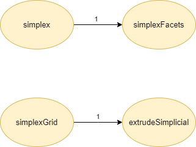
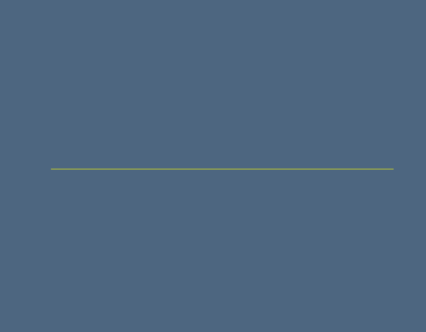
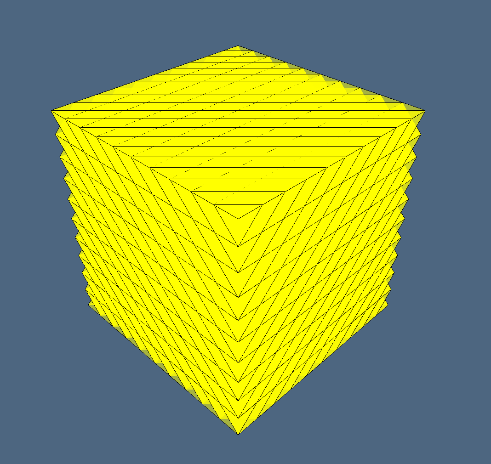
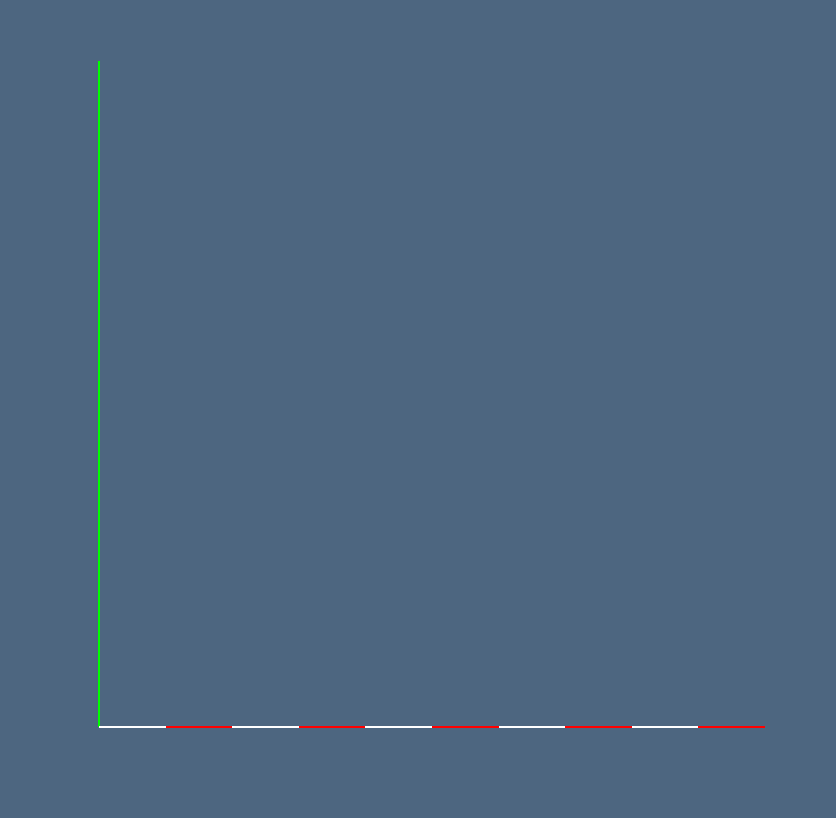

# Studio preliminare: LAR cuboids & simplices
Nel progetto numero 1 - **LAR cuboids & simplices** sono stati analizzati i due file sorgenti *largrid.jl* e *simplexn.jl* presenti all'interno della libreria **Lar** (Linear Algebraic Rapresentation). 

## Autori: 
* Alessandro Dell'Oste: 502589
* Maurizio Brini: 505195
* Manuel Granchelli: 512406

## Repo GitHub: 
https://github.com/adelloste/LinearAlgebraicRepresentation.jl

## Indice
* [Simplexn.jl](#simplexn.jl)
* [Largrid.jl](#largrid.jl)
* [Grafo dipendenze](#grafo-dipendenze)
* [Esempi](#esempi)

## Simplexn.jl
Il primo dei due file analizzati *simplexn.jl* contiene un insieme di funzioni per generare un **complesso cellulare di simpliciali**. Un complesso simpliciale è un'aggregazione ordinata di simplessi, ossia un'unione di un certo numero di simplessi che si intersecano fra loro su *facce comuni*. 

In particolare, nella libreria sono definite funzioni per la creazione efficiente di complessi simpliciali, generati da complessi simpliciali di *dimensione parziale*, la produzione di *griglie simpliciali* di qualsiasi dimensione e *l'estrazione di faccette* (cioè di (d-1)-facce) di complessi simpliciali di dimensione d. Le funzioni hanno complessità temporale lineare rispetto alla dimensione dell'output. 

Entrando nel dettaglio, la generazione di simplessi è definita dalla funzione `simplex` che restituisce un simplesso *n-dimensionale* nel *n-spazio* del modello LAR *(Figura ([3](#id-fig-3)))*. Un modello LAR è definito da una coppia di *(vertici, celle)*. All'interno di tale funzione viene effettuata una chiamata alla funzione `simplexFacets`, presente sempre all'interno del file *simplexn.jl*, che si occupa dell'estrazione delle *(d-1)-faccette* non orientate di simplessi *d-dimensionali* e restituisce la rappresentazione LAR di input della topologia di un **complesso cellulare**. È presente anche l'estrusione di simpliciali che è definita dalla funzione `extrudeSimplicial` che si occupa di generare il modello con vertici e celle di un'estrusione di un modello LAR *(Figure ([5](#id-fig-5)), ([6](#id-fig-6)), ([7](#id-fig-7)))*. Infine, la funzione `simplexGrid` si occupa della generazione di griglie simpliciali di qualsiasi dimensione e forma *(Figura ([4](#id-fig-4)))*.

## Largrid.jl 
Nel secondo file analizzato sono presenti funzioni per la generazione e prodotto di *complessi multidimensionali*. A seconda della dimensione dell'input possono generare complessi di dimensione completa *(solidi)* oppure complessi di dimensione parziale. 

In particolare, vengono implementati complessi cellulari di dimensioni parziali (ad esempio 0 o 1-dimensionali) con coordinate intere, la cui generazione è definita nella funzione `grid_0` che genera un complesso uniforme 0-dimensionale e nella funzione `grid_1` per la generazione di un complesso uniforme 1-dimensionale. Per generare la rappresentazione LAR delle celle di complessi 0 o 1-dimensionali è definita anche la funzione `larGrid` che restituisce l'ordine del complesso di output. 

La generazione di **complessi cuboidali** avviene tramite il prodotto cartesiano definito nella funzione `larCellProd`. Il prodotto di d complessi 1-dimensionali generano celle solide, mentre il prodotto di n complessi 0-dimensionali e (n-d) complessi 1-dimensionali generano celle non solide nello spazio n-dimensionale. La funzione per il **prodotto cartesiano** viene chiamata all'interno della funzione `larGridSkeleton` che produce lo schema d-dimensionale di una griglia cuboidale di dimensione data in input tramite il parametro `shape`. A sua volta, la funzione `larGridSkeleton`, è chiamata all'interno di un'altra principale funzione chiamata `cuboidGrid` che è definita come un generatore multidimensionale. Questa funzione può generare o una griglia d-dimensionale solida di d-cuboidi nello spazio d-dimensionale oppure l'array dello schema della forma a seconda del parametro passato in input. Infine, un'altra principale funzione presente all'interno di *largrid.jl* è `larModelProduct` che prende in input due *modelli LAR* e ne restituisce il loro prodotto cartesiano *(Figura ([9](#id-fig-9)))*.


## Grafo dipendenze

{#id-fig-1 .class width=40%}

{#id-fig-2 .class width=60%}

## Esempi
Nella seguente sezione sono riportati esempi, con i relativi output, di alcune funzioni dei due file sorgenti. Negli esempi viene utilizzata la libreria in Julia **ViewerGL** per la visualizzazione interattiva 3D dei dati geometrici.

### Simplexn.jl

```julia
model = Lar.simplex(2)
" Output: ([0.0 1.0 0.0; 0.0 0.0 1.0], [[1, 2, 3]])"
GL.VIEW([ GL.GLGrid(model..., GL.COLORS[7],0.7), 
GL.GLLines(model...), GL.GLFrame ]);
```
\pagebreak
**Output:**

{#id-fig-3 .class width=50% margin=auto}

```julia
grid_2d = Lar.simplexGrid([3,3])
" Output: ([0.0 1.0 ... 2.0 3.0; 0.0 0.0 ... 3.0 3.0], 
[[1, 2, 5], [2, 5, 6], [2, 3, 6], [3, 6, 7], [3, 4, 7], 
[4, 7, 8], [5, 6, 9], ... [12, 15, 16]])"
GL.VIEW([ GL.GLGrid(grid_2d..., GL.COLORS[7],0.7), 
GL.GLLines(grid_2d...), GL.GLFrame ]);
```
**Output:**

{#id-fig-4 .class width=50% margin=auto}

```julia
VOID = [[]], [[1]]
"Output: (Vector{Any}[[]], [[1]])"
model = Lar.extrudeSimplicial( VOID, ones(10) )
"Output: ([0 1 ... 9 10], [[1, 2], [2, 3], [3, 4], 
[4, 5], [5, 6], [6, 7], [7, 8], [8, 9], [9, 10], [10, 11]])"
GL.VIEW([ GL.GLGrid(model..., GL.COLORS[7], 0.5) ]);
```
**Output:**

{#id-fig-5 .class width=50% margin=auto}

```julia
model = Lar.extrudeSimplicial( model, ones(10) )
" Output: ([0 1 ... 9 10; 0 0 ... 10 10], [[1, 2, 12], 
[2, 12, 13], [2, 3, 13], [3, 13, 14], [3, 4, 14], 
[4, 14, 15], [4, 5, 15], [5, 15, 16], [5, 6, 16], 
[6, 16, 17]  ...  [105, 106, 116], [106, 116, 117], 
[106, 107, 117], [107, 117, 118], [107, 108, 118], 
[108, 118, 119], [108, 109, 119], [109, 119, 120], 
[109, 110, 120], [110, 120, 121]])"
GL.VIEW([ GL.GLLines(model..., GL.COLORS[7]), GL.GLFrame ]);
```
**Output:**

{#id-fig-6 .class width=50% margin=auto}

```julia
model = Lar.extrudeSimplicial( model, ones(10) )
" Output: ([0 1 ... 9 10; 0 0 ... 10 10; 0 0 ... 10 10], 
[[1, 2, 12, 122], [2, 12, 122, 123], [12, 122, 123, 133],
[2, 12, 13, 123],  ... [1199, 1209, 1210, 1320], 
[1209, 1210, 1320, 1330], [1210, 1320, 1330, 1331]])"
GL.VIEW([ GL.GLGrid(model..., GL.COLORS[7], 0.5) ]);
```
**Output:**

{#id-fig-7 .class width=50% margin=auto}

### Largrid.jl
```julia
model1D = Lar.qn(5)([.1,-.1])
" Output: ([0.0 0.1 ... 0.8999999999999999 0.9999999999999999], 
[[1, 2], [3, 4], [5, 6], [7, 8], [9, 10]])"
GL.VIEW([ GL.GLFrame2, GL.GLGrid( model1D...,GL.COLORS[1],1 ) ]);
```
\pagebreak
**Output:**

{#id-fig-8 .class width=50% margin=auto}

```julia
model2D = Lar.larModelProduct([ model1D, model1D ])
" Output: ([0.0 0.0 ... 0.9999999999999999 0.9999999999999999; 
0.0 0.1 ... 0.8999999999999999 0.9999999999999999], 
[[1, 2, 12, 13], [3, 4, 14, 15], [5, 6, 16, 17], 
[7, 8, 18, 19], [9, 10, 20, 21], [23, 24, 34, 35], 
[25, 26, 36, 37],  ...  [97, 98, 108, 109]])"
GL.VIEW([ GL.GLFrame2, GL.GLGrid( model2D...,GL.COLORS[1],1 ) ]);
```
**Output:**

{#id-fig-9 .class width=50%}

```julia
model3D = Lar.INSR(Lar.larModelProduct)([model1D, model1D, model1D])
" Output: ([0.0 0.0 ... 0.9999999999999999 0.9999999999999999; 
0.0 0.0 ... 0.9999999999999999 0.9999999999999999; 
0.0 0.1 ... 0.8999999999999999 0.9999999999999999], 
[[1, 2, 12, 13, 122, 123, 133, 134], 
[3, 4, 14, 15, 124, 125, 135, 136], 
[5, 6, 16, 17, 126, 127, 137, 138], 
[7, 8, 18, 19, 128, 129, 139, 140], ...  
[1063, 1064, 1074, 1075, 1184, 1185, 1195, 1196], 
[1065, 1066, 1076, 1077, 1186, 1187, 1197, 1198]])"
GL.VIEW([ GL.GLFrame, GL.GLPol( model3D...,GL.COLORS[1],1 ) ]);
```
**Output:**

{#id-fig-10 .class width=50%}
