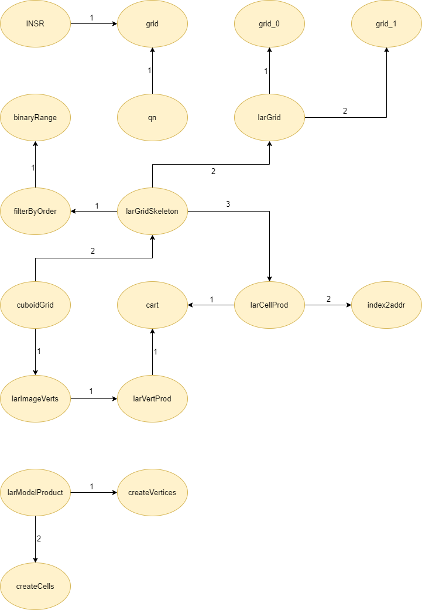

# Studio definitivo: LAR cuboids & simplices
Nel seguente documento verrà illustrato lo studio definitivo per il progetto numero 1 - **LAR cuboids & simplices**, nel quale sono state eseguite ulteriori ottimizzazioni e modifiche per i due file sorgenti *largrid.jl* e *simplexn.jl* presenti all'interno della libreria **Lar** (Linear Algebraic Rapresentation). Infine verrano fatte le considerazioni finali.

## Autori
* Alessandro Dell'Oste: 502589
* Maurizio Brini: 505195
* Manuel Granchelli: 512406

## Repo GitHub
https://github.com/adelloste/LinearAlgebraicRepresentation.jl

## Indice
* [Obiettivo](#obiettivo)
* [Grafo dipendenze](#grafo-dipendenze)
* [Conclusioni](#conclusioni)

### Obiettivo 
L'obiettivo del seguente studio definitivo è stato quello di utilizzare ulteriori tecniche di ottimizzazione per rendere il codice  più efficiente seguendo le specifiche del libro consigliato **Julia High Performace**. 
Il codice è stato modificato sui notebook e testato per verificare il corretto funzionamento, i tempi di esecuzione e la memoria allocata tramite le macro `@btime` e `@benchmark`. Successivamente sono stati modificati i due file sorgenti **largrid.jl** e **simplexn.jl** e sono stati eseguiti i test unitari presenti all'interno del **[Repo GitHub](https://github.com/adelloste/LinearAlgebraicRepresentation.jl)** nella cartella `test` per verificare il corretto funzionamento del codice.
In seguito alle ottimizzazioni introdotte, è stato aggiornato anche il grafo delle dipendenze come riportato di seguito.

### Grafo dipendenze

### Conclusioni
Il progetto è stato portato a termine seguendo le specifiche e le indicazioni date durante tutte le lezione del corso di Calcolo Parallelo e Distribuito. Lo studio è partito dall'analisi della documentazione relativa al progetto numero 1 - *Lar Cuboids & Simplices* e dall'analisi del codice. Il codice è stato clonato localmente e sono stati rimossi tutti i file non necessari per il progetto asssegnato. Per verificare il corretto funzionamento del codice sono stati eseguiti i test unitari presenti nella cartella `test` del progetto. Il repo che contiene il codice, è stato configurato con due julia-action:
* **julia-runtest**: esegue i test unitati ogni volta che si rilascia sul branch main. File di configurazione `Runtests.yml`.
* **documenter**: genera la documentazione dai file markdown e docstring. File di configurazione `Documenter.yml`.
La cartella che contiene i due file è la seguente: **[.github/workflows](https://github.com/adelloste/LinearAlgebraicRepresentation.jl/blob/main/.github/workflows/)**.

Successivamente è stato analizzato il codice per trovare le funzioni da poter ottimizzare. Come prima cosa sono stati corretti i tipi delle variabili all'interno di tutte le funzioni. In seguito, il codice è stato rifattorizzato suddividendo le funzioni più complesse in funzioni elementari, come è possibile osservare dal grafo delle dipendenze, introducendo delle ottimizzazioni che hanno reso il codice più leggibile e performante. Infine, seguendo le specifiche del libro consigliato **Julia High Performace** sono state inserite alcune macro per parallelizzare il codice. Le ottimizzazioni introdotte, come si può osservare dai test effettuati nei quali è stata utilizzata la macro `@btime`, hanno portato alla riduzione di memoria allocata e a tempi di esecuzione inferiori.

Lo svolgimento di questo progetto ci ha evidenziato l'importanza del calcolo parallelo su diversi campi applicativi. Inoltre, ci ha fatto capire l'importanza di Julia, in quanto essendo un linguaggio giovane è stato progettato avendo in mente la complilazione Just In Time che permette di avere delle garanzie di efficienza che altri linguaggi più datati non hanno.
